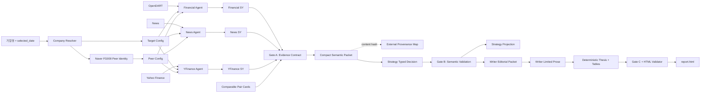

# Financial Agent

### Point-in-Time, Evidence-Grounded Multi-Agent Financial Research System

**Research prototype** | **Python 3.10+** | **OpenDART + News + Yahoo Finance**

기업명과 기준일을 입력하면 국내 상장기업의 재무, 뉴스, 시장 데이터를 point-in-time 방식으로 수집하고, 근거 추적이 가능한 Buy/Hold/Sell 리서치 HTML 보고서를 생성합니다.

이 프로젝트의 핵심은 생성된 문장을 다시 원천 근거로 쓰지 않는 것입니다. Financial, News, YFinance Agent는 각자의 원천만 primary evidence로 사용하고, 다른 도메인은 편향 점검용 compact secondary context로만 사용합니다. Strategy Agent는 self-contained semantic card를 읽어 투자 의견과 typed 해석을 만들며, Writer Agent는 해당 판단을 바꾸지 않고 제한된 서술 섹션만 작성합니다. 투자 thesis, 핵심 근거표와 risk matrix는 검증된 Strategy 구조에서 조립됩니다.

> 연구 및 실험 목적의 프로토타입입니다. 생성 결과는 투자 자문이나 매매 권유가 아닙니다.

## 초록

LLM 기반 금융 보고서는 서로 다른 데이터 도메인을 자연스럽게 연결할 수 있지만, 다음 문제가 발생하기 쉽습니다.

1. 모델이 만든 해석을 다음 모델이 원천 근거로 오인합니다.
2. 여러 Agent가 같은 사실을 반복해 증거 수가 부풀려집니다.
3. 기준일 이후 데이터가 과거 시점 분석에 섞입니다.
4. 전체 보고서와 schema를 매 호출마다 반복 전송해 API 입력이 커집니다.
5. 불완전한 데이터가 자동으로 Hold를 유도할 수 있습니다.

본 시스템은 원천 evidence catalog, 검증된 claim ledger, self-contained Strategy packet, Writer editorial packet과 외부 provenance map을 분리합니다. 날짜, 수치, 비교 가능성, semantic card 연결, schema, provenance와 HTML 구조는 결정론적 코드로 검사합니다. LLM은 Strategy의 투자 판단·해석과 Writer의 제한된 독자용 문장을 생성하지만, 근거 선택 상한, 표의 관찰값, 비교 범위와 필수 limitation은 코드 계약이 통제합니다.

## 연구 질문과 범위

본 구현은 다음 연구 질문을 다룹니다.

| 연구 질문 | 시스템의 대응 |
| --- | --- |
| RQ1. 과거 기준일 보고서에 당시 공개되지 않은 정보가 섞이지 않는가? | 모든 원천에 `< selected_date` cutoff를 적용하고 filing, market, news 날짜를 별도로 검증합니다. |
| RQ2. 여러 Agent의 중복 해석을 독립 근거처럼 집계하지 않는가? | 원천 evidence, derived fact, secondary context를 분리하고 `evidence_family` 단위로 factor 중복을 제한합니다. |
| RQ3. LLM의 정성 판단을 유지하면서 의미 오류를 구조적으로 차단할 수 있는가? | typed Strategy decision과 recommendation bridge를 사용하고 Gate A/B/C에서 비교 범위, 방향, limitation과 의미 보존을 검사합니다. |
| RQ4. 전체 보고서를 반복 전송하지 않고 재현 가능한 호출 범위를 만들 수 있는가? | bounded semantic packet, editorial packet, fingerprint cache와 실행 단위 token telemetry를 사용합니다. |

현재 평가 범위는 국내 비금융 일반 상장사의 기존 별도 재무제표 경로입니다. 은행·보험업 특수 계정과 연결 재무제표 전용 계약, 해외 기업은 본 회귀 범위에 포함하지 않습니다. 컨센서스, 목표주가, 시장점유율과 view-change 조건도 수집·판단 계약에서 제외합니다.

## 주요 기여

### Point-in-time data contract

`selected_date`는 **장 시작 전 보고서 시점**입니다. 따라서 당일 데이터는 사용할 수 없고 모든 원천은 `< selected_date` 조건을 만족해야 합니다.

예를 들어 `selected_date=20251031`, `news_window=1m`이면 유효 범위는 `2025-10-01`부터 `2025-10-30`까지입니다. 2025년 3분기보고서가 10월 31일 이후 제출됐다면 당시 이용 가능한 최신 정기보고서인 반기보고서를 사용합니다.

### Primary evidence와 secondary context 분리

- `raw_source`: DART, 기사 event, Yahoo Finance 원천 값
- `deterministic_derived`: 코드로 계산한 재무비율, 수익률, 기술지표, valuation
- `secondary_context`: 다른 도메인의 compact 요약. framing과 limitation에만 사용
- LLM summary, stance, interpretation, reasoning: evidence로 재사용 금지

### 계층적 Strategy 추론

Strategy는 전체 upstream 보고서를 그대로 읽지 않습니다.

1. 결정론적 packet builder가 Financial 최대 7개, News 기본 6개·중요 사건 보존 시 최대 10개, Market 최대 3개, Valuation 최대 2개, Peer 최대 6개의 semantic card를 구성합니다.
2. 각 card에는 관찰값, 날짜·기간·단위, `evidence_family`, `observation_basis`, `comparison_scope`, evidence 역할과 비교 제한이 함께 들어갑니다.
3. Decision Agent 한 번의 호출이 모든 card의 typed assessment, recommendation bridge, 비교 finding, risk와 Buy/Hold/Sell을 생성합니다.
4. Gate B가 KOSPI와 selected peer 범위, 독립 evidence family, forward support와 투자 영향 방향을 검사합니다. raw evidence ID와 원천 경로는 LLM packet 밖의 provenance map에서만 추적합니다.
5. Writer thesis는 검증된 recommendation bridge를 사용하고 핵심 근거표와 risk matrix는 구조화 card에서 결정론적으로 생성합니다.

News card는 사건의 발생 여부와 재무 연결 수준에 따라 `confirmed_financial`, `probable_financial`, `occurrence_only`, `operational_context`로 구분합니다. `context_only` 사건은 forward factor로 사용할 수 없습니다. Buy 또는 Sell에는 방향과 일치하는 서로 다른 forward `evidence_family`가 최소 2개 필요하지만, 데이터 부족 자체가 Hold를 강제하지는 않습니다.

### 단일 명령과 자동 identity 해석

사용자는 DART 고유번호나 ticker를 미리 찾을 필요가 없습니다. OpenDART 법인 목록, KRX/Naver/Yahoo 시장 identity, Naver Finance 업종분석을 사용해 대상과 국내 peer 1개사를 자동 해석합니다.

### 실행 단위 token telemetry와 cache

정상 cold-cache 논리 호출 범위는 `target 6 + peer 6 + final 2 = 14`입니다. final은 Strategy Decision 1회와 Writer 1회이며 별도 Content Planner, Review, Repair 호출은 없습니다. 재시도는 별도 transport attempt로 집계하고, Hold 편향 평가 같은 실험 호출은 정상 파이프라인에서 제외합니다. 동일 입력, prompt, schema, model의 검증된 응답은 fingerprint cache로 재사용합니다.

## 시스템 구조



### 구성요소

| 구성요소 | Primary evidence | Secondary context | 주요 산출물 |
| --- | --- | --- | --- |
| Financial Agent | DART 재무제표, 제품·서비스 매출, 주식 수 | 주요 뉴스, 시장 snapshot | 재무 분석과 DART evidence |
| News Agent | 기사·공시 event | DART 사업 문맥, 시장 snapshot | event 분석과 News evidence |
| YFinance Agent | 원주가, 조정주가, 거래량, KOSPI, FX, valuation | DART snapshot, 주요 뉴스 | 시장 분석과 Market evidence |
| SY Agents | 각 도메인 원천 evidence | 역할이 고정된 context | `strong`, `context_only`, `exclude` |
| Peer Comparison | 양사의 검증된 구조화 수치 | 없음 | `peer_comparison_dataset.json` |
| Strategy Packet Builder | 검증된 claim·수치·comparable pair | framing-only context | self-contained semantic card와 외부 provenance map |
| Strategy Decision | semantic card | 명시적 limitation | Buy/Hold/Sell, typed assessment, recommendation bridge |
| Strategy Projection | 검증된 typed decision | 없음 | `strategy_report.json/.md`; 별도 LLM 호출 없음 |
| Writer | 승인된 editorial card와 Strategy 해석 | 없음 | 사업·시장, catalyst, data-limit 문장 |
| Deterministic Assembler | recommendation bridge, card observation, typed risk | 없음 | thesis, 핵심 근거표, risk matrix |
| Gate A/B/C + HTML Validator | packet, typed decision, Writer payload | 없음 | pass/fail validation |

## 방법론

### Self-contained semantic card

Strategy가 읽는 기본 단위는 raw evidence ID가 아니라 다음 의미 정보를 포함한 card입니다.

```json
{
  "card_key": "market.relative_performance",
  "domain": "market",
  "label": "시장 상대성과",
  "evidence_family": "market_price_performance",
  "observation_basis": "time_series",
  "comparison_scope": "market_benchmark",
  "comparison_entities": {"benchmark_name": "KOSPI"},
  "decision_use": "factor_eligible",
  "primary_observation": {},
  "reader_limitations": []
}
```

`comparison_scope`는 `none`, `company_history`, `market_benchmark`, `selected_peer`, `industry_aggregate`를 구분합니다. KOSPI 상대성과를 업종 비교로 바꾸거나 selected peer 1개를 동종업계 전체로 일반화하는 문장은 Gate B와 Gate C가 거부합니다.

### Typed Strategy decision

Strategy LLM은 모든 card에 대해 `investment_effect`, `materiality`, `section`, `interpretation`을 반환합니다. 최종 판단은 다음 recommendation bridge를 함께 가져야 합니다.

| 필드 | 의미 |
| --- | --- |
| `current_price_rationale` | 현재 가격·시장 상태가 판단에 반영된 방식 |
| `forward_support` | 6~12개월 전망을 지지하는 forward evidence |
| `valuation_counterweight` | 절대 또는 selected-peer valuation의 상쇄 요인 |
| `residual_uncertainty` | 확인되지 않은 사업·재무·시장 불확실성 |
| `decision_confidence` | 판단 확신도. `data_coverage`와 별도 관리 |

LLM이 중복 free-form `strategy_report`를 생성하지는 않습니다. 검증이 끝난 typed decision을 코드가 `strategy_report.json`과 `strategy_report.md`로 투영하므로, Strategy 판단과 Writer 입력 사이에 두 번째 해석본이 생기지 않습니다.

Buy/Hold/Sell은 정량 점수 합산이나 고정 임계값으로 계산하지 않습니다. LLM이 6~12개월 관점에서 `decisive`·`supporting` 긍정/부정 factor의 상대적 중요도를 비교해 의견을 선택하고, 코드는 해당 선택이 사용할 수 있는 근거의 자격과 일관성을 검증합니다. Buy와 Sell에는 방향이 일치하는 독립 forward evidence family가 최소 2개 필요합니다. Hold에는 데이터 부족을 이유로 한 기본 우선순위가 없으며, 실제 긍정·부정 상쇄 논리가 recommendation bridge에 제시돼야 합니다. 따라서 구조적 근거 요건은 재현 가능하지만 세 의견 사이의 절대 경계는 LLM의 정성적 calibration에 의존합니다.

### Writer 정보 계층화

Writer editorial packet은 Strategy packet 전체를 다시 전달하지 않고 최종 문서에 필요한 card 합집합만 포함합니다. 문서 구성은 `investment_call_thesis`, `business_market_context`, `key_evidence_table`, `catalysts_execution`, `risk_monitoring_matrix`, `data_limits`의 여섯 component로 고정됩니다.

| 최종 요소 | 생성 주체 | 제약 |
| --- | --- | --- |
| 투자 thesis | Strategy recommendation bridge를 코드가 조립 | Writer가 의견·균형 논리를 변경할 수 없음 |
| 사업·시장 문단 | Writer LLM | component에 허용된 card만 사용하고 문장별 `_claim_units` 제출 |
| 핵심 근거표의 `핵심 근거` | Strategy card를 Writer 표시 alias로 변환 | Writer LLM이 문구를 만들지 않음 |
| 핵심 근거표의 `확인된 수치·사실` | card의 `reader_observation`을 코드가 줄바꿈 표시로 변환 | 수치·날짜·비교기업을 재작성하지 않음 |
| 핵심 근거표의 `투자 해석`·`영향` | Strategy typed assessment | Writer 응답 뒤 결정론적으로 덮어씀 |
| catalyst 문단 | Writer LLM | 직접성·materiality가 보존된 News card만 사용 |
| risk matrix | Strategy typed risk를 코드가 표로 변환 | monitoring point와 근거 순서를 보존 |
| data-limit 문단 | Writer LLM + typed limitation requirement | 필수 category 누락 시 Gate C 실패 |

핵심 근거표는 우선순위가 정의된 최대 8개 card를 사용합니다. 현재 우선순위는 동일기간 재무 추세, 영업현금흐름, 재무상태·유동성, 주요 제품·서비스 매출, 선택일 valuation, 시장 상대성과, peer 매출 성장률, peer valuation입니다. 이용 가능한 우선 card가 5개 미만일 때만 Strategy가 `decisive` 또는 `supporting`으로 평가한 eligible primary card를 보충하며, 이 경우에도 보이는 `핵심 근거` label은 Writer 표시 계약에서 가져옵니다.

### 의미 검증 Gate

| Gate | 실행 시점 | 주요 검증 |
| --- | --- | --- |
| Gate A | Strategy 호출 전 | card budget, 날짜·기간·단위, eligibility, section routing, opaque ID 제거, provenance hash |
| Gate B | Strategy 호출 후 | card 전수 assessment, factor family 중복, Buy/Sell forward family 수, KOSPI·peer 비교 범위, recommendation bridge, risk 근거, 독자용 문장의 내부 field/card key 누출 |
| Gate C | Writer 호출 후 | component card coverage, 문장별 grounding, Strategy 의미·시간 의미 보존, 필수 limitation, 내부 ID 유출, 표 순서 |
| HTML Validator | 렌더링 후 | 필수 section/table, A4 print layout, 숫자 표시, 숨김 metadata, 금지 콘텐츠와 문서 구조 |

검증 실패 시 Review 또는 Repair LLM을 추가 호출하지 않고 실행을 실패시킵니다. 실패 payload는 성공 execution cache로 인정하지 않지만, 동일 fingerprint의 raw Writer 응답은 보존해 코드 변경 후 추가 API 호출 없이 다시 정규화·검증할 수 있습니다.

## 재현 방법

### 환경 구성

```bash
git clone https://github.com/TaeHyoK/Financial_Agent.git
cd Financial_Agent

python -m venv .venv
source .venv/bin/activate
python -m pip install --upgrade pip
python -m pip install -e ".[dev]"
```

`configs/.env`를 생성합니다.

```dotenv
OPENAI_API_KEY=your_openai_api_key
DART_API_KEY=your_opendart_api_key
```

API key 파일은 Git에 올리지 마십시오.

### 전체 보고서 생성

```bash
PYTHONPATH=src python -m orchestration.full_report_pipeline \
  --company-name SK바이오팜 \
  --selected-date 20251031 \
  --news-window 1m \
  --llm-model gpt-5.4-mini \
  --no-progress
```

설치 후 console script를 사용할 수도 있습니다.

```bash
financial-report \
  --company-name SK바이오팜 \
  --selected-date 20251031 \
  --news-window 1m
```

### Ablation CLI

기본 명령에 ablation flag를 추가하면 실험별 산출물을
`Output_total/ablations/<experiment-name>/` 아래에 분리해 저장합니다. 아무 flag도 주지 않은 기존 명령은 baseline 동작을 그대로 유지합니다.

```bash
# 1. 모든 SY Agent 제거
financial-report --company-name SK바이오팜 --selected-date 20251031 \
  --no-sy --experiment-name no_sy

# 2-a. 한 domain씩 제거 (반복 지정 가능)
financial-report --company-name SK바이오팜 --selected-date 20251031 \
  --exclude-domain news --experiment-name no_news

# 2-b. 한 domain만 Strategy에 제공
financial-report --company-name SK바이오팜 --selected-date 20251031 \
  --only-domain dart --experiment-name dart_only

# 3. 각 Agent가 전용 primary data만 사용
financial-report --company-name SK바이오팜 --selected-date 20251031 \
  --primary-data-only --experiment-name primary_only

# 4. competitor/peer 경로 전체 제거
financial-report --company-name SK바이오팜 --selected-date 20251031 \
  --no-competitor --experiment-name no_competitor

# 조합 실험과 실행 전 command 확인
financial-report --company-name SK바이오팜 --selected-date 20251031 \
  --no-sy --only-domain news --no-competitor \
  --experiment-name news_only_no_sy --dry-run
```

domain 이름은 `financial`(별칭 `dart`), `news`, `yfinance`(별칭 `yf`, `market`)를 지원합니다. `--only-domain`과 `--exclude-domain`은 동시에 사용할 수 없으며 세 domain을 모두 제거할 수도 없습니다.

`--exclude-domain`과 `--only-domain`은 동일한 upstream 수집 결과에서 Strategy에 노출되는 evidence domain을 통제합니다. 제외 domain에서 다른 Agent로 전달된 secondary context도 함께 차단합니다. `--primary-data-only`는 더 앞 단계에서 Financial=DART, News=News, YFinance=시장/provider 데이터만 사용하도록 각 Agent 요청 자체를 다시 실행합니다. `--no-sy`는 SY 호출을 생략하되 downstream schema가 달라지는 교란을 막기 위해 검증 전 Agent 산출물을 명시적인 `unverified passthrough` adapter로 전달합니다.

지원 뉴스 범위는 `2w`, `1m`, `3m`입니다. 모두 선택일 하루 전까지의 inclusive window로 변환됩니다.

#### 논문용 전체 ablation matrix

`financial-report-ablation`은 Full과 11개 ablation 조건을 조건·반복별 독립 디렉터리에서 실행하고, suite manifest와 JSON/Markdown 요약표를 생성합니다.

```bash
PYTHONPATH=src python -m orchestration.ablation_experiment \
  --company-name SK바이오팜 \
  --selected-date 20251031 \
  --news-window 1m \
  --peer-stock-code 003120 \
  --replicates 3 \
  --suite-id skbiopharm_20251031_ablation_v1 \
  --no-progress
```

기본 matrix는 `full`, `no_sy`, 세 domain 제거, `primary_only`, `no_competitor`, 세 단일-domain 조건, `full_context`, `free_form_writer`입니다. 기본값인 `--freeze-upstream`은 domain/context ablation이 Full의 동일한 upstream 파일을 사용하게 하며 각 파일의 SHA-256을 manifest에 기록합니다. `free_form_writer`는 Full의 Strategy 산출물까지 고정하고 Writer만 재실행합니다.

중단된 suite는 같은 인자로 `--resume`을 추가해 이어갈 수 있습니다. 성공한 특정 조건을 다시 실행해야 할 때는 `--condition <name> --resume --force-condition <name>`을 사용하며, 강제 재실행은 별도 attempt 디렉터리와 execution ID를 사용합니다.

### Identity와 명령만 확인

```bash
PYTHONPATH=src python -m orchestration.full_report_pipeline \
  --company-name SK바이오팜 \
  --selected-date 20251031 \
  --news-window 1m \
  --dry-run
```

Naver peer 조회가 일시적으로 불가능한 경우에만 종목코드를 명시적으로 넘길 수 있습니다.

```bash
--peer-stock-code 003120
```

### 최종 파일

```text
Output_total/Writer/{company_name}_{selected_date}/report.html
```

SK바이오팜 사례의 실제 경로는 다음과 같습니다.

```text
Output_total/Writer/SK바이오팜_20251031/report.html
```

## 입력 계약

### 사용자 입력

| 입력 | 예시 | 의미 |
| --- | --- | --- |
| `company_name` | `SK바이오팜` | 거래소에서 사용하는 기업 표시명 |
| `selected_date` | `20251031` | 장 시작 전 보고서 시점 |
| `news_window` | `1m` | 뉴스와 출력 시장 데이터 window |

영문 약어와 OpenDART 법인명의 한글 표기가 다른 경우 문자명 alias를 사용합니다. 예를 들어 `SK바이오팜`은 OpenDART의 `에스케이바이오팜`과 연결됩니다. 출력에는 사용자가 입력한 기업명을 유지합니다.

### 자동 생성 input 파일

```text
Output_total/runs/{target_run_key}/resolved_inputs/
├── target_company.json
├── peer_company.json
└── identity_resolution.json
```

`target_company.json`과 `peer_company.json`은 기존 하위 에이전트 config 계약을 그대로 사용합니다.

```json
{
  "company_code": "00878696",
  "corp_code": "00878696",
  "company_name": "SK바이오팜",
  "stock_code": "326030",
  "ticker": "326030.KS",
  "date_range": "20251001-20251030",
  "selected_date": "20251031",
  "selected_date_policy": "before_market_open",
  "llm_model": "gpt-5.4-mini"
}
```

### Agent별 핵심 input 파일

| 소비자 | 핵심 input |
| --- | --- |
| Financial | `target_company.json`, `financial_input_manifest.json`, DART XML/API 응답 |
| News | `report_context.json`, `llm_summary_request.json`, `dart_lightweight.json`, `market_summary.json` |
| YFinance | `target_company.json`, `market_full_dataset.json`, `dart_lightweight.json`, News verified report |
| Peer Comparison | 양사의 `Financial/final_report.json`, `Y_Finance/market_full_dataset.csv`, `Y_Finance/final_report.json` |
| Strategy Packet Builder | target의 세 `final_report.json`, 검증 evidence, `peer_comparison_dataset.json` |
| Strategy LLM | `strategy_compact_packet_v2.json`의 self-contained card; provenance 파일은 전달하지 않음 |
| Writer Packet Builder | `strategy_compact_packet_v2.json`, `strategy_packet_provenance_v2.json`, `strategy_decision_output_v2.json` |
| Writer LLM | `writer_editorial_packet_v2.json`; Strategy 전체 보고서와 raw provenance는 전달하지 않음 |

## 데이터 원천별 전처리

### OpenDART 재무·공시

```text
OpenDART corpCode.xml
  -> 기업명/종목코드 identity 해석
  -> selected_date 이전 정기보고서 탐색
  -> 최신 보고서 + 전년 동일 기간 + 최대 3개 연간 이력
  -> XML 표 추출과 계정/기간/단위 정규화
  -> 제품·서비스 매출, 주식 수, TTM, 재무비율
  -> Financial evidence catalog
```

| 단계 | 처리 방법 |
| --- | --- |
| 공시 cutoff | 접수시각을 알 수 없는 경우 당일 공시를 제외하고 접수일 `< selected_date`만 사용합니다. |
| 최신 보고서 | 이론상 분기를 강제하지 않고 실제 제출된 사업·1분기·반기·3분기 보고서를 최신 회계기간부터 탐색합니다. |
| 과거 추세 | 최신 보고서와 전년 동일 기간을 연결하고, 사업보고서에서 최대 3개 연간 이력을 구성합니다. |
| 기간 기준 | 재무상태표는 시점 값, 손익·현금흐름은 누적 값을 사용합니다. YTD와 연간을 같은 성장률 계산에 섞지 않습니다. |
| 계정·단위 | 기업별 한글 계정명을 canonical metric에 연결하고 원·천원·백만원 multiplier를 KRW 계산값과 함께 보존합니다. |
| 제품 매출 | `주요 제품 및 서비스` 표의 품목별 매출액과 공시 비중을 추출합니다. 시장점유율은 생성하지 않습니다. |
| TTM | `직전 연간 + 당기 누적 - 전년 동일 기간 누적`에 필요한 세 값이 모두 있을 때만 계산합니다. |
| 주식 수 | 발행주식과 자기주식으로 유통주식 수를 계산해 선택일 valuation에 사용합니다. |

주요 artifact:

```text
dart_master.json
dart_2y_handoff.json
dart_main.json
dart_lightweight.json
```

### 뉴스

```text
Google News RSS
  -> 날짜·URL·제목·snippet 정규화
  -> 기사 URL과 snippet 보강
  -> 중복 제거
  -> BGE embedding과 HDBSCAN event clustering
  -> DART 사업 문맥 reranking
  -> 기간 요약과 News claim 검증
```

| 단계 | 처리 방법 |
| --- | --- |
| 기간 | `selected_date - window`부터 `selected_date - 1일`까지 수집합니다. |
| 정규화 | 제목, URL, 언론사, 기사일, snippet을 공통 record로 변환합니다. |
| URL 보강 | Google News URL을 publisher URL로 해석하고 snippet이 없으면 원문 페이지에서 보강을 시도합니다. |
| 중복 제거 | 정규화 URL을 우선 사용하고 필요 시 제목·언론사·기사일 조합을 사용합니다. |
| 사업 문맥 | 최신 DART의 사업 개요, 제품, 원재료·설비, 계약·R&D를 chunking해 기업 관련도 계산에만 사용합니다. |
| Embedding | 기본 BGE 모델을 사용하고 사용할 수 없으면 hashing embedding으로 fallback합니다. |
| Clustering | 날짜 bucket 안에서 HDBSCAN event를 구성해 반복 보도의 mention count가 날짜 간 부풀지 않게 합니다. |
| event 의미화 | 사건 상태, 기업 직접성, materiality, 재무 연결 여부와 기사 coverage를 typed metadata로 정규화합니다. |
| Strategy card | event 요약과 대표 excerpt 최대 2개, 기사·언론사 count를 포함합니다. opaque evidence ID와 전체 기사 목록은 전달하지 않습니다. |

기본 `max_results`는 200입니다. URL 보강은 외부 사이트 응답에 따라 수분 이상 걸릴 수 있습니다. 2025-10-31 1개월 cold regression에서는 target과 peer의 News collect가 각각 약 13분 걸렸고, warm 실행에서는 fingerprint cache로 재사용됐습니다.

주요 artifact:

```text
raw_news.parquet
news_events.parquet
report_context.json
news_agent_evidence_map.json
```

### Yahoo Finance 시장·밸류에이션

```text
종목 + KOSPI + USD/KRW
  -> 2년 warm-up OHLCV 수집
  -> 원주가/조정주가 분리
  -> 기술지표와 상대성과 계산
  -> selected_date 이전 마지막 거래일 snapshot
  -> DART 결합 선택일 valuation
  -> Market evidence catalog
```

| 단계 | 처리 방법 |
| --- | --- |
| 수집 구간 | 60일 지표 초기 결측을 줄이기 위해 최대 2년 warm-up을 내려받고 출력은 요청 window로 다시 절단합니다. |
| 가격 기준 | valuation과 독자용 종가는 raw `Close`, 수익률·이동평균·drawdown·상대성과는 `Adj Close`를 사용합니다. |
| corporate action | dividend와 split을 별도 컬럼과 manifest event count로 보존합니다. |
| 거래일 | 종목 거래일을 기준 index로 사용하고 KOSPI·FX만 직전 값으로 forward-fill합니다. 종목 가격은 채우지 않습니다. |
| 기술지표 | 1·5·20·60일 수익률, MA5·20·60, RSI14, MACD, Bollinger width, 변동성, volume ratio, OBV를 계산합니다. |
| snapshot | `date < selected_date`인 행 중 가장 최근 거래일을 선택합니다. 2025-10-31 사례의 실제 market date는 2025-10-30입니다. |
| provider valuation | 날짜 열만 사용하고 기준일 이후와 수정 가능성이 큰 `Current` snapshot을 제외합니다. |
| 선택일 valuation | raw close와 DART 유통주식 수·TTM·자본으로 market cap, P/E, P/S, P/B를 계산합니다. |
| 날짜 분리 | provider 표시일과 계산 기준일이 다르면 `different_as_of_dates`로 유지하고 직접 비교하지 않습니다. |
| EV 배수 | point-in-time 부채·현금·EBITDA가 없으면 재계산하지 않고 provider-direct 참고값으로만 둡니다. |

주요 artifact:

```text
market_full_dataset.csv/json
market_summary_YYYYMMDD.csv/json
market_summary.json
valuation_snapshot.json
manifest.json
```

### Naver Finance peer identity

Naver Finance `coinfo.naver`의 WiseReport 업종분석 FG000 표는 **peer identity 선택에만** 사용합니다.

1. target을 제외한 국내 후보를 읽습니다.
2. FG000 후보 중 시가총액 절대 차이가 가장 작은 1개사를 선택합니다.
3. 선택된 종목코드로 OpenDART identity를 확인합니다.
4. 양사에 같은 DART·News·YFinance 파이프라인을 실행합니다.
5. 최종 비교 수치는 로컬 검증 산출물에서 다시 구성합니다.

FG000 응답의 `MKT_VAL`이 비어 있으면 해당 FG000 종목들의 Naver item 페이지에서 현재 시가총액을 제한적으로 보완한 뒤 같은 절대 차이 규칙을 적용합니다. 후보 집합 자체를 다른 출처로 확장하지는 않습니다. Naver 시가총액, period label과 fallback 기록은 `peer_resolution.json` 감사 파일에만 남고 LLM config나 금융 근거로 전달되지 않습니다. 현재 SK바이오팜 사례에서는 `일성아이에스(003120.KS)`가 선택됩니다.

### LLM 투입 전 공통 변환

1. 날짜, 기간, 단위, metric, source ref를 가진 stable evidence ID를 감사용 catalog에 부여합니다.
2. 원천 값과 결정론적 파생값만 evidence catalog에 등록하고 LLM 해석은 새 evidence로 승격하지 않습니다.
3. 검증된 claim과 수치를 사람이 읽을 수 있는 self-contained semantic card로 변환합니다.
4. raw evidence ID, source path와 source file은 card content hash가 있는 외부 provenance map으로 분리합니다.
5. 다른 도메인은 `secondary_context_assessment`로 분리하고 factor가 아닌 framing·limitation 용도로만 전달합니다.
6. 절대 경로, 실행시각, 전체 원 보고서, 미참조 catalog 항목을 API 입력에서 제거합니다.
7. 결측은 추정하지 않고 limitation 또는 `unavailable`로 유지합니다.

## 근거 계층과 provenance

### Evidence

```json
{
  "evidence_id": "YF_STOCK_RETURN_20D",
  "domain": "market",
  "origin_type": "deterministic_derived",
  "source_ref": "market_full_dataset.latest.stock_return_20d",
  "source_date": "2025-10-30",
  "period": "20D",
  "metric": "stock_return_20d",
  "value": 0.0779,
  "unit": "ratio"
}
```

### Claim

```json
{
  "claim_id": "YF_CLAIM_001",
  "statement": "20일 절대수익률은 양수이나 시장 대비 초과수익률은 음수다.",
  "evidence_use": "strong",
  "primary_evidence_ids": [
    "YF_STOCK_RETURN_20D",
    "YF_STOCK_EXCESS_RETURN_20D"
  ],
  "limitations": []
}
```

### Evidence ID의 역할

`evidence_id`는 현재 구조에서 LLM이 원문을 다시 조회하는 retrieval handle이 아닙니다. 하위 Agent의 claim 검증과 외부 감사에서 원천 record를 연결하는 key입니다. Strategy와 Writer는 ID만 보고 판단하지 않으며, 필요한 날짜·수치·비교 대상·대표 excerpt와 limitation이 포함된 semantic card를 직접 읽습니다.

각 card는 provenance map에서 다음 항목과 연결됩니다.

```json
{
  "market.relative_performance": {
    "source_evidence_ids": ["YF_STOCK_EXCESS_RETURN_20D"],
    "source_paths": ["yfinance.primary_evidence_catalog.stock_excess_return_20d"],
    "source_files": ["Y_Finance/final_report.json"],
    "strategy_card_sha256": "..."
  }
}
```

따라서 전체 원문을 매번 전송하지 않으면서도 card가 어떤 검증 record에서 만들어졌는지는 추적할 수 있습니다. News의 경우 Strategy가 대표 excerpt를 읽지만 기사 전문을 ID로 재조회하지는 않습니다.

### 규칙

- raw evidence ID는 원천 catalog와 외부 provenance map에 실제로 존재해야 하며 LLM packet에는 opaque ID만 단독으로 넣지 않습니다.
- secondary context는 primary claim의 직접 증거나 상태 변경 근거가 될 수 없습니다.
- Strategy는 runtime strict schema가 허용한 semantic `card_key`만 반환할 수 있습니다.
- Strategy와 Writer의 모든 핵심 판단은 semantic card와 content hash로 외부 provenance에 연결됩니다.
- Buy/Hold/Sell과 투자 해석 문장을 규칙 기반 코드로 생성하지 않습니다. 코드는 card 선택·표시, 비교 가능성, thesis 조립과 의미 검증을 담당합니다.
- Repair Agent와 Review Agent는 사용하지 않습니다.
- Writer 검증 실패 결과는 성공 execution cache로 인정하지 않으며 추가 repair 호출 없이 실행을 실패시킵니다. fingerprint가 같은 raw 응답은 재검증용으로만 재사용할 수 있습니다.

## 실험 설계와 token 집계

### 평가 프로토콜

회귀 기준은 `SK바이오팜`, `selected_date=2025-10-31`, 뉴스 `1m`이며 Naver Finance에서 자동 선택된 `일성아이에스`를 peer로 사용합니다. 평가는 다음 네 층으로 나눕니다.

| 평가 층 | 측정 대상 |
| --- | --- |
| Point-in-time | DART 접수일, 뉴스 기간, 시장 snapshot이 모두 기준일 이전인지 |
| Structural | strict schema, card budget, provenance, component와 HTML 형식이 유효한지 |
| Semantic | 비교 범위, factor 독립성, Strategy 의미·시간 의미와 필수 limitation이 보존되는지 |
| Operational | 논리 호출 수, transport retry, cache suppression과 input/output token 규모 |

정량 평가는 실행 manifest와 validator 결과를 사용합니다. 정성 품질 평가는 Strategy recommendation bridge와 최종 보고서가 같은 긍정·부정 균형을 유지하는지, 근거표의 관찰·해석·영향이 동일 card에서 왔는지 직접 대조합니다.

### 정상 cold-cache 범위

| Role | 논리 호출 | 단계 |
| --- | ---: | --- |
| target | 6 | News period summary, News analysis, News SY, Financial SY, YFinance analysis, YFinance SY |
| peer | 6 | target과 동일한 6단계 |
| final | 2 | Strategy Decision, Writer |
| 합계 | 14 | 정상 보고서 생성 경로 |

다음은 별도로 취급합니다.

- 네트워크 재시도: `transport_attempts`에만 증가
- deterministic collection과 peer dataset: LLM 호출 수에서 제외
- Hold 편향 평가: `run_role=evaluation`으로 정상 집계에서 제외
- cache hit: 호출 0회, `cache_suppressed_calls`로 기록

실행별 파일:

```text
Output_total/runs/{run_key}/executions/{execution_id}/
├── full_pipeline_manifest.json
├── llm_usage_manifest.jsonl
└── llm_usage_summary.json
```

### 2025-10-31 1개월 cold-cache 기준선

실행 ID `20260712T021706081119Z`에서 측정한 v2 전환 시점의 cold-cache 결과입니다. 14개 transport가 모두 한 번에 성공했고 당시 Gate A/B/C와 HTML validator가 통과했습니다.

| 지표 | 값 |
| --- | ---: |
| 논리 호출 | 14 |
| input tokens | 127,131 |
| output tokens | 29,338 |
| total tokens | 156,469 |
| 최대 단일 입력 추정 | 28,214 |
| 100k target 초과 | 0건 |
| 200k hard limit 초과 | 0건 |

당시 Strategy compact data packet은 30,576 bytes, 약 7,900 tokens였고 dynamic response schema를 포함한 실제 Strategy 요청은 13,100 input tokens였습니다. Writer 요청은 12,917 input tokens였습니다. 가장 큰 입력은 target News analysis의 28,214 tokens였습니다.

이 수치는 **고정된 역사적 기준선**입니다. 이후 comparison scope, evidence family, recommendation bridge, 필수 limitation과 결정론적 표 계약을 보완했지만 전체 데이터 수집을 다시 cold-cache로 실행하지 않았으므로, 위 token 합계를 현재 final-stage 산출물의 신규 end-to-end 계측값으로 해석해서는 안 됩니다.

### 현재 1개월 full-pipeline semantic regression

실행 ID `fix_strategy_writer_gate_1m_warm2`로 SK바이오팜 2025-10-31 데이터 1개월·Strategy 1개월 일반 파이프라인을 자동 peer 선택부터 최종 HTML까지 다시 실행한 상태입니다. 자동 선택된 peer는 일성아이에스(003120)였고 14개 논리 호출과 transport가 모두 첫 시도에 성공했습니다.

| 지표 | 현재 값 |
| --- | ---: |
| Strategy card | 22개: Financial 6, News 6, Market 3, Valuation 2, Peer 5 |
| Strategy packet telemetry | 39,609 bytes, estimated 10,754 tokens |
| Writer editorial card | 21개 |
| 핵심 근거표 | 8개 행 |
| risk matrix | 5개 행 |
| 최종 의견 | Hold, 1개월 |
| data coverage / decision confidence | medium / medium |
| Gate B | pass |
| Gate C + HTML validator | pass, notes 0건 |
| 내부 field / semantic card key HTML 노출 | 0건 / 0건 |

이번 실행의 target, peer, Strategy, Writer 소요 시간은 각각 221.267초, 200.177초, 22.992초, 14.216초였습니다. LLM usage는 input 137,897, output 26,264, total 164,161 tokens입니다. 수집 계층의 기존 로컬 artifact가 존재한 상태에서 실행했으므로 위의 2025-10-31 cold-cache 수집 시간 기준선과는 구분합니다.

### Hold 편향 평가

Production prompt를 바꾸지 않고 같은 claim 수, evidence 등급, 날짜, limitation 수를 가진 세 개의 반사실 packet을 평가합니다.

| 시나리오 | 기대 | 관측 |
| --- | --- | --- |
| 강한 긍정 | Buy | Buy |
| 균형 혼합 | Hold | Hold |
| 강한 부정 | Sell | Sell |

평가 결과:

- directional accuracy: `1.0`
- extreme direction accuracy: `1.0`
- strong positive/negative의 Hold 축소: `0건`
- 평가 호출: 6회, 27,238 total tokens
- 정상 14회 집계에서는 제외

재실행:

```bash
PYTHONPATH=src python -m Agent_Team.Strategy_Agent.evaluate_recommendation_bias \
  --llm-model gpt-5.4-mini \
  --env-file configs/.env
```

단일 3개 시나리오 평가는 구조적 편향 검사의 최소 사례이며 통계적 일반화를 의미하지 않습니다.

## 산출물

```text
Output_total/
├── runs/{target_run_key}/
│   ├── resolved_inputs/
│   ├── executions/{execution_id}/
│   ├── run_manifest.json
│   ├── step_fingerprints.json
│   ├── full_pipeline_manifest.json
│   └── llm_usage_summary.json
├── Financial/{run_key}/
│   ├── dart_master.json
│   ├── final_report.json
│   └── final_validation.json
├── News/{run_key}/
│   ├── final_report.json
│   ├── final_validation.json
│   └── output/sy_agent/
├── Y_Finance/{run_key}/
│   ├── market_full_dataset.json
│   ├── valuation_snapshot.json
│   ├── final_report.json
│   └── final_validation.json
├── Competitor/{target_run_key}/
│   ├── peer_resolution.json
│   └── peer_comparison_dataset.json
├── Strategy/{target_run_key}/
│   ├── strategy_input_bundle.json
│   ├── strategy_compact_packet_v2.json
│   ├── strategy_packet_provenance_v2.json
│   ├── strategy_packet_telemetry_v2.json
│   ├── strategy_decision_cache_v2.json
│   ├── strategy_decision_output_v2.json
│   ├── strategy_semantic_validation_v2.json
│   ├── strategy_report.json
│   └── strategy_report.md
└── Writer/{target_run_key}/
    ├── writer_editorial_packet_v2.json
    ├── writer_packet_provenance_v2.json
    ├── llm_writer_output.json
    ├── writer_report_payload.json
    ├── writer_validation_report.json
    └── report.html
```

`Output_total*`은 runtime artifact이므로 Git 추적에서 제외됩니다.

`strategy_report.json/.md`는 `strategy_decision_output_v2.json`의 구조적 projection입니다. `llm_writer_output.json`은 제한된 Writer prose 응답이고, `writer_report_payload.json`은 thesis와 두 표를 결정론적으로 합성한 검증 대상입니다.

## 결과

| 항목 | 결과 |
| --- | --- |
| 대상 | SK바이오팜 |
| 국내 peer | 일성아이에스 |
| 보고서 시점 | 2025-10-31 장 시작 전 |
| 실제 데이터 cutoff | 2025-10-30 |
| 뉴스 범위 | 2025-10-01 ~ 2025-10-30 |
| 최신 DART | 2025-06-30 반기 누적, 2025-08-14 제출 |
| 시장 snapshot | 2025-10-30 |
| 최종 의견 | Hold |
| 투자기간 | 6~12개월 |
| data coverage | high |
| decision confidence | medium |
| Strategy / Writer card | 21개 / 16개 |
| 핵심 근거표 / risk matrix | 8개 / 5개 행 |
| Strategy validation | Gate A/B pass |
| Writer validation | 전체 Gate C/HTML check pass, notes 0건 |

최종 Hold 판단은 재무·현금흐름 개선과 일성아이에스 대비 성장성·수익성 우위가 긍정적이지만, KOSPI 대비 상대성과와 절대·상대 valuation 부담이 이를 상쇄한다고 평가한 결과입니다. 제품 비중은 `주요 제품·서비스 공시표 기준`으로 한정하고, filing lag, 단일 비교기업 범위, valuation 입력일 혼합, 제품 표 범위와 뉴스의 미확인 재무 연결을 필수 limitation으로 명시합니다. data coverage와 판단 confidence는 각각 `high`, `medium`으로 분리합니다.

이 사례는 시스템이 설계한 의미 계약과 point-in-time 동작을 검증하는 회귀 사례입니다. 한 기업의 Hold 결과만으로 추천 성능이나 초과수익을 주장하지 않습니다.

## 테스트

```bash
pytest -q
python -m compileall -q src
git diff --check
```

모듈별 실행:

```bash
pytest -q src/Agent_Team/Financial_Agent/tests
pytest -q src/Agent_Team/News_Agent/tests
pytest -q src/Agent_Team/YFinance_Agent/tests
pytest -q src/Agent_Team/Competitor_Agent/tests
pytest -q src/Agent_Team/Strategy_Agent/tests
pytest -q 'src/Agent_Team/Writer Agent/tests'
pytest -q src/orchestration/tests src/shared/tests
```

테스트는 point-in-time cutoff, adjusted/raw close 분리, identity alias, Naver peer parser fixture, evidence contract, Strategy source refs, Writer grounding, retry/token 집계, full pipeline command와 cache를 포함합니다.

2026-07-13 기준 전체 회귀 suite의 기준은 `207 passed`입니다.

## 저장소 구조

```text
.
├── configs/
├── src/
│   ├── Agent_Team/
│   │   ├── Financial_Agent/
│   │   ├── News_Agent/
│   │   ├── YFinance_Agent/
│   │   ├── Competitor_Agent/
│   │   ├── Strategy_Agent/
│   │   └── Writer Agent/
│   ├── orchestration/
│   │   ├── company_resolver.py
│   │   ├── end_to_end_loop.py
│   │   ├── full_report_pipeline.py
│   │   └── usage_summary.py
│   └── shared/
├── LLM_INPUT_SCHEMA_CLEANUP_PLAN.md
├── LLM_PIPELINE_STRUCTURE_OPTIMIZATION_PLAN.md
├── REPORT_QUALITY_GAP_ANALYSIS_AND_IMPROVEMENT_PLAN.md
├── WRITER_AGENT_HOIN_MIGRATION_PLAN.md
└── pyproject.toml
```

## 한계와 타당성 위협

- 외적 타당성: 현재 정성 회귀는 한 기업, 한 peer, 한 기준일에 한정되며 다른 산업·기업 규모·시장 국면으로 일반화할 수 없습니다.
- 범위 타당성: 국내 비금융 일반기업의 기존 별도 재무제표 경로를 전제로 하며 은행·보험과 연결 재무제표 특수 계약은 평가하지 않았습니다.
- 기준일 이후 제출된 공시는 소급 사용하지 않으므로 최신 분기 자료가 없을 수 있습니다.
- 국내 peer는 Naver FG000 후보 중 한 회사만 선택하므로 업종 평균이나 순위를 대표하지 않습니다.
- Naver의 현재 board identity fallback은 과거 시장 이전을 완전히 복원하지 못할 수 있습니다.
- Strategy와 Writer는 News 대표 excerpt를 읽지만 evidence ID를 이용해 기사 전문을 재조회하지 않습니다. excerpt가 원문의 전체 맥락을 대표하지 못할 위험이 남습니다.
- 핵심 근거표의 우선 축은 코드로 정의됩니다. 데이터가 희소할 때 보충 선택은 적응형이지만, 고정 우선순위가 기업별 중요도를 완전히 반영하지 못할 수 있습니다.
- 뉴스 URL·snippet 보강과 Yahoo/Naver 응답은 외부 서비스 상태에 따라 cold 실행 시간과 가용성이 달라집니다.
- 최신 final-stage 계약은 기존 upstream data로 검증했으며, 보완 후 신규 cold-cache token benchmark는 아직 수행하지 않았습니다.
- Buy/Hold/Sell은 고정 수익률·valuation 임계값이 아닌 LLM의 정성적 상대 중요도 판단입니다. Gate는 최소 근거와 의미 정합성을 보장하지만 추천 경계의 경제적 최적성을 보장하지 않습니다.
- consensus, 목표주가, 시장점유율, view-change 조건은 계약에 포함하지 않습니다.
- LLM 출력은 schema와 evidence로 제한되지만 확률적 오류 가능성을 완전히 제거하지는 못합니다.
- 실제 투자 적용 전 장기 backtest, 거래비용·슬리피지, 외부 전문가 검증이 필요합니다.

## 인용

연구나 프로젝트에서 사용할 경우 repository URL과 commit hash를 함께 기록하십시오.

```bibtex
@software{taehyok_financial_agent_2026,
  author = {TaeHyoK},
  title = {Financial Agent: Evidence-Grounded Multi-Agent Financial Research System},
  year = {2026},
  url = {https://github.com/TaeHyoK/Financial_Agent}
}
```

## 라이선스

현재 별도 라이선스가 지정되어 있지 않습니다. 공개 배포 또는 재사용 전에 저장소 소유자의 이용 조건을 확인하십시오.
